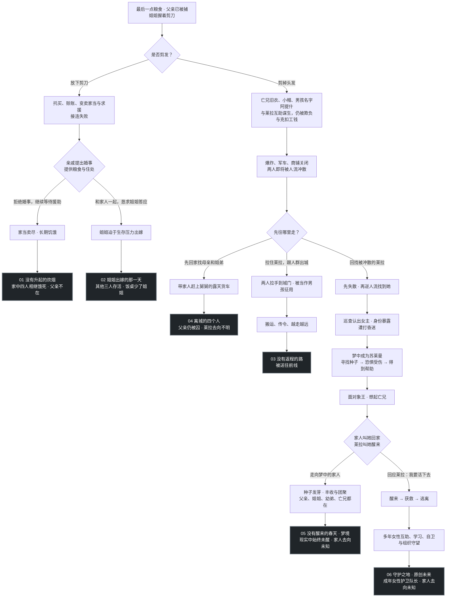

# 0.6.0 故事流程

新版已替换历史五结局、七次选择的限制。见[六路线决策树与编辑文件](decision-tree/决策树-v060.md)。[0.5.1流程历史快照](STORY-FLOW-v051-history.md)仅用于版本研究。

```mermaid
flowchart TD
 OPEN[最后一点粮食 · 父亲已被捕<br/>姐姐握着剪刀] --> CUT{是否剪发？}
 CUT -->|放下剪刀| AID[托买、赊账、变卖家当与求援<br/>接连失败]
 AID --> MARRIAGE{亲戚提出婚事<br/>提供粮食与住处}
 MARRIAGE -->|拒绝婚事，继续等待援助| HUNGER[家当卖尽 · 长期饥饿]
 HUNGER --> E01[01 没有升起的炊烟<br/>家中四人相继饿死 · 父亲不在]
 MARRIAGE -->|和家人一起，恳求姐姐答应| WEDDING[姐姐迫于生存压力出嫁]
 WEDDING --> E02[02 姐姐出嫁的那一天<br/>其他三人存活 · 饭桌少了姐姐]
 CUT -->|剪掉头发| WORK[亡兄旧衣、小帽、男孩名字阿提什<br/>与莱拉互助谋生，仍被欺负与克扣工钱]
 WORK --> WAR[爆炸、军车、商铺关闭<br/>两人即将被人流冲散]
 WAR --> WHERE{先往哪里走？}
 WHERE -->|先回家找母亲和姐弟| TRUCK[带家人赶上舅舅的露天货车]
 TRUCK --> E04[04 离城的四个人<br/>父亲仍被囚 · 莱拉去向不明]
 WHERE -->|拉住莱拉，跟人群出城| GATE[两人拉手到城门 · 被当作男孩征用]
 GATE --> MARCH[搬运、传令、越走越远]
 MARCH --> E03[03 没有返程的路<br/>被送往前线]
 WHERE -->|回找被冲散的莱拉| FIND[先失散 · 再逆人流找到她]
 FIND --> HIT[巡查认出女主 · 身份暴露<br/>遭打昏迷]
 HIT --> TALE[梦中成为苏莱曼<br/>寻找种子 → 恐惧受伤 → 得到帮助]
 TALE --> KING[面对象王 · 想起亡兄]
 KING --> VOICES{家人叫她回家<br/>莱拉叫她醒来}
 VOICES -->|走向梦中的家人| SPRING[种子发芽 · 丰收与团聚<br/>父亲、姐姐、幼弟、亡兄都在]
 SPRING --> E05[05 没有醒来的春天 · 梦境<br/>现实中始终未醒 · 家人去向未知]
 VOICES -->|回应莱拉：我要活下去| WAKE[醒来 → 获救 → 逃离]
 WAKE --> YEARS[多年女性互助、学习、自卫与组织守望]
 YEARS --> E06[06 守护之地 · 原创未来<br/>成年女性护卫队长 · 家人去向未知]
 classDef ending fill:#202529,color:#fff,stroke:#77818a,stroke-width:2px;
 class E01,E02,E03,E04,E05,E06 ending;
```
